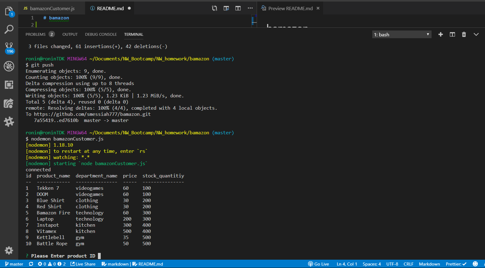
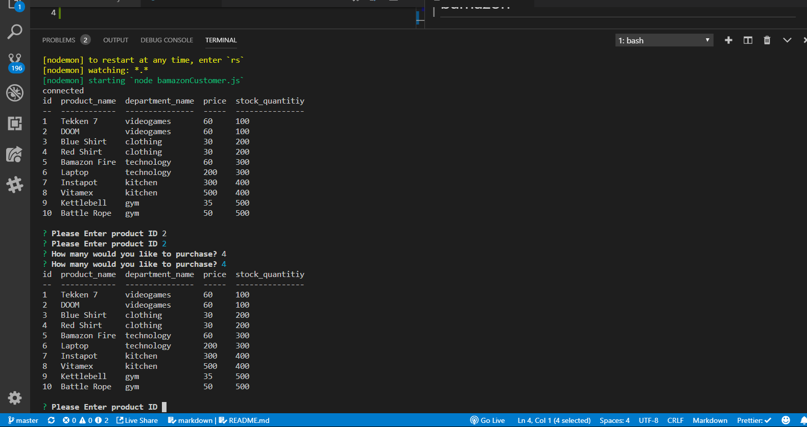

# Bamazon

## Overview

A project to sharpen node.js and mysql skills to create a amazon like store front and interface to navigate it.

### Customer View

1. Display products table data
2. Prompt user to enter in product i.d of product the wish to "purchase"
3. Prompt user to enter in the amount of units they want to "purchase".
4. Updates database after "purchase".

Bamazon-Table_Display:

Bamazon-Inquirer-UI:

